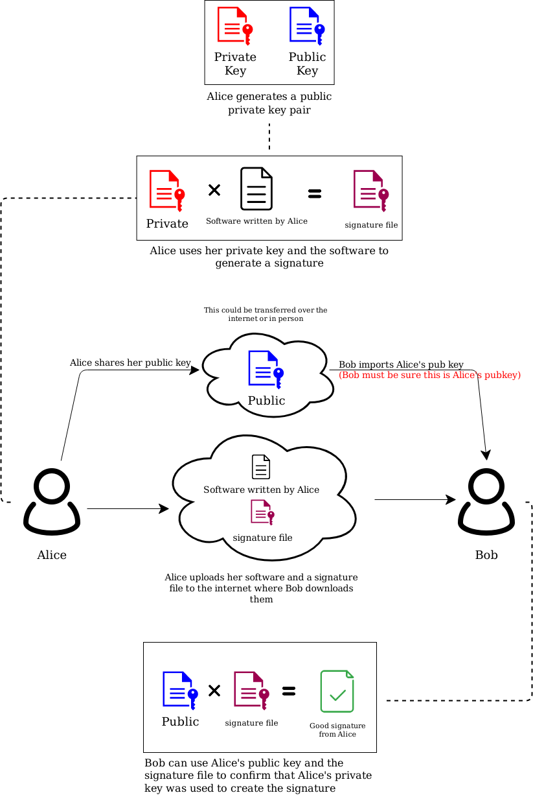

## Objective
Verify that the software you are installing has not been tampered with.
## Overview
A digital signature certifies and timestamps a document. If the document is subsequently modified in any way, a verification of the signature will fail. A digital signature can serve the same purpose as a hand-written signature with the additional benefit of being tamper-resistant.

To create and verify signatures we will be using a public/private keypair.




Jump to your OS 
- [Mac](#mac)
- [Windows](#windows)
- [Linux](#linux)

## Mac

```
cd ~/Downloads/
```

```
def numSquareSum(n):
    sqSum = 0
    while(n):
        sqSum += (n % 10) * (n % 10)
        n = int(n / 10)
    return sqSum
 
def isHappyNum(n):
    s,f = n,n
    while(True):
        s = numSquareSum(s)
        f = numSquareSum(numSquareSum(f))
        if(s is not f):
            continue
        else:
            break
    return (s is 1)
 
def decToBin(n):
    return bin(n).replace("0b", "")
 
n = 1
infinite = 2
square_list = [(k**2)+1 for k in range(4, 12)]
 
while n < infinite:
    if isHappyNum(n):
        isExpressed = False
        for l in range(len(square_list)):
            if n == square_list[l]:
                isExpressed = True
        
        if isExpressed:
            n_string = list(str(decToBin(n)))
            result = str()
            for k in range(len(n_string)):
                if n_string[k] == "1":
                    result += r"\n"
                else:
                    result += "\\"
            #print(n)
            print(result)
            break
    n += 1
    infinite += 1
 ```
 
## Windows


balls
## Linux
The first thing we will cover is navigating using terminal.

To change folders we will use:
```
cd
```
I will move from my root folder to Downloads folder:
```
cd ~/Downloads/
```
