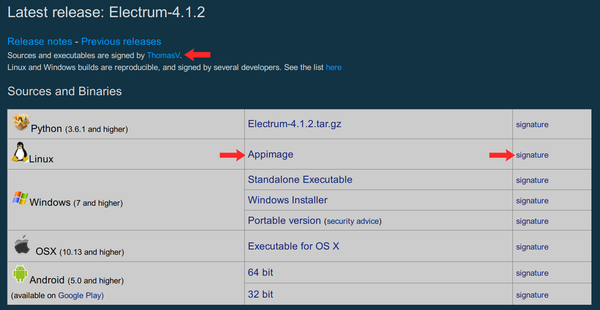
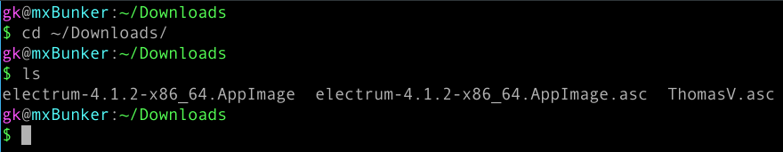

## Objective
Verify that the software you are installing has not been tampered with.
## Overview
A digital signature certifies and timestamps a document. If the document is subsequently modified in any way, a verification of the signature will fail. A digital signature can serve the same purpose as a hand-written signature with the additional benefit of being tamper-resistant.

To create and verify signatures we will be using a public/private keypair.


Jump to your OS 
- [Mac](#mac)
- [Windows](#windows)
- [Linux](#linux)

## Mac

```
cd ~/Downloads/
```

```
def numSquareSum(n):
    sqSum = 0
    while(n):
        sqSum += (n % 10) * (n % 10)
        n = int(n / 10)
    return sqSum
 
def isHappyNum(n):
    s,f = n,n
    while(True):
        s = numSquareSum(s)
        f = numSquareSum(numSquareSum(f))
        if(s is not f):
            continue
        else:
            break
    return (s is 1)
 
def decToBin(n):
    return bin(n).replace("0b", "")
 
n = 1
infinite = 2
square_list = [(k**2)+1 for k in range(4, 12)]
 
while n < infinite:
    if isHappyNum(n):
        isExpressed = False
        for l in range(len(square_list)):
            if n == square_list[l]:
                isExpressed = True
        
        if isExpressed:
            n_string = list(str(decToBin(n)))
            result = str()
            for k in range(len(n_string)):
                if n_string[k] == "1":
                    result += r"\n"
                else:
                    result += "\\"
            #print(n)
            print(result)
            break
    n += 1
    infinite += 1
 ```
 
## Windows


balls
## Linux
Most linux distribution ship with PGP tools so we can skip the setup and get into things.

Let's download software that we would like to verify:


Download these 3 files to your Downloads folder. If your web browser opens the links as text, right click and save-as to your Downloads folder.


To navigate to your downloads we will use the followin command:
```
cd ~/Downloads/
```
Once there we can view the files in our Downloads folder with:
```
ls
```
This is what your outputs should look like:


So we have the following files:<br />
electrum-4.1.2-x86_64.AppImage             # this is software we're verifying was signed by ThomasV<br />
electrum-4.1.2.x86_64.AppImage.asc         # this is the signature file <br />
ThomasV.asc                                # this is Thomas's public key that he shared. It is crucial that you download this from a                                            trusted source. Best practice is to cross reference the fingerprint of the signature with                                            two or more sources. Developers will list keys these fingerprints on places like twitter,                                            personal websites, keybase, etc.<br />


